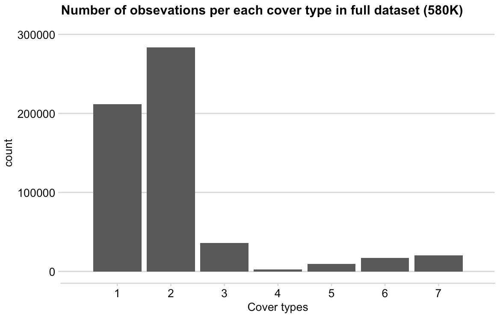
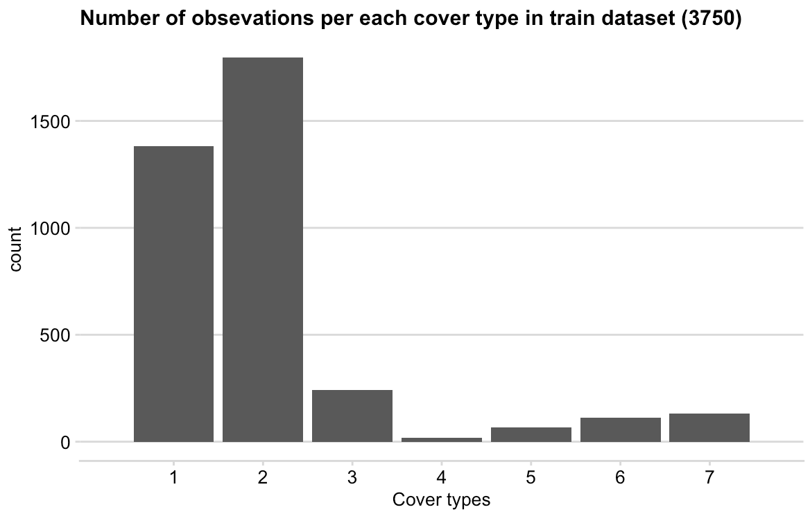

## Classification of Forest cover types 

As an exercise, I've tried to apply my k-NN implementation to the well-known multi-class classication problem dataset from the [UCI ML benchmark repository]
(http://www.ics.uci.edu/~mlearn/MLRepository.html), Forest Cover types (available [here](https://archive.ics.uci.edu/ml/datasets.php)).

The goal of this problem is to predict the forest cover type from cartographic variables. There are 7 different cover types (e.g., spruce or different pines) and 54 input variables. Here I consider a small subset of the data, 3750 training and 1250 test patterns.

The training and test data are in the files `covtype_train.csv` and `covtype_test.csv`, respectively. The last column indicates the label.


### Implementation 

To run:

```
python3 main.py data/covtype_test.csv data/covtype_train.csv 
```

The script does the following:

* center and normalise the input data
* create distance matrix
* run kNN with k = [1,3,5,7,9]
	* on test dataset, raw inputs and normalised
	* on train dataset, raw inputs and normalised
* perform 5-fold Cross Validation to find the best K


### Results

The kNN was run both on the raw data and the centred and normalised data. The kNN results for test data and training data are in the tables below.

#### _Running kNN of test data_

| k  / accuracy % | Raw input  | Centered and Normalised |
|--------------|------------|-------------------------|
| 1 | 73.09 | 70.32 |
| 3 | 70.63 | 70 |
| 5 | 69.92 | 68.87 |
| 7 | 71.68 | 70.08 |
| 9 | 70.64 | 68.88 |

According to the results of kNN performed on the raw data (left column), the k value of 1 provides the most accurate prediction results (accuracy 73.09%). This is surprising. For more reliable results it is necessary to perform classification on the normalised and centred data (right column). The rescaled data gives somewhat confusing classification results. The prediction accuracies are the highest and the same for k=1 and k=9.

Also, it is worth noting that the percentage accuracies for all k-values are very close, and differ by ~0.2 %. There it is difficult to say whether the highest scoring k is actually the optimal choice. For both raw and rescaled data the second best k is 7, which is the number of classes we expect to see in the data.


#### _Running kNN of train data_

| k/accuracy % | Raw input  | Centered and Normalised |
|--------------|------------|-------------------------|
| 1 | 100 | 100 |
| 3 | 86.32 | 87.49 |
| 5 | 81.57 | 80.21 |
| 7 | 78.53 | 77.52 |
| 9 | 76.82 | 75.94 |

On the training data the prediction accuracy for k=1 is 100% (for both raw and rescaled data), which is expected. The accuracy percentage decreases as k-value gets larger.

#### _Running 5-fold Cross Validation kNN to identify the best k_

**Best k: 1**

The best value of k according to the 5-fold cross-validation on the training set only is 1. The accuracy percentages for this k on the full training and test set are (raw: 100%, rescaled: 100%) and (raw: 73.04%, rescaled: 70.32%), respectively.
Similarly, the k-value of 1 is surprising here, because we expect the correct number of classes to be 7.

#### _Possible explainations_

Possible explaination to this could be that the selected train dataset subset (3750 observations) is too small to provide efficient classification reference (the original dataset size is 580K obs.). It would be worth exploring the perfomance with the larger training set (although here we might run into speed issues from algorith implementation (and the method properties itself)).

Also worth mentioning, even though there are 7 expected classes in the dataset, the dataset is very imbalanced in terms of number of observations per class, as show in diagram below:



The balance between groups in the train data subset is very similar to the original large dataset.



Fianlly, it is possibel that kNN is just not suitable to make good classification predictions on this dataset. Alternatives to try would be decision trees, SVMs. 

### Some notes on kNN method

The KNN algorithm assumes that similar things exist in close proximity. In other words, similar things are near to each other.  KNN works by finding the distances between a query and all the examples in the data, selecting the specified number examples (K) closest to the query, then votes for the most frequent label (in the case of classification) or averages the labels (in the case of regression).

To select the K that’s right for the given data, we run the KNN algorithm several times with different values of K and choose the K that reduces the number of errors we encounter while maintaining the algorithm’s ability to accurately make predictions when it’s given data it hasn’t seen before.

KNN is a non-parametric, 'lazy' learning algorithm. Its purpose is to use a database in which the data points are separated into several classes to predict the classification of a new sample point. 'Non-parametric' means that it does not make any assumptions on the underlying data distribution. In other words, the model structure is determined from the data. Therefore, KNN could and probably should be one of the first choices for a classification study when there is little or no prior knowledge about the distribution data.


#### Note about data
_Covertype_

The actual forest cover type for a given observation (30 x 30 meter cell) was determined from US Forest Service (USFS) Region 2 Resource Information System (RIS) data. Independent variables were derived from data originally obtained from US Geological Survey (USGS) and USFS data. Data is in raw form (not scaled) and contains binary (0 or 1) columns of data for qualitative independent variables (wilderness areas and soil types).
